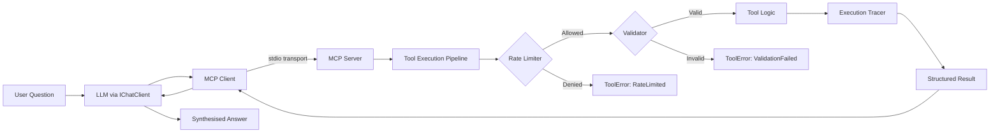

# Sentinel.MCP — Detailed Project Plan

## AI-Powered API Health Monitor & Diagnostics Platform

A .NET MCP platform that gives AI agents real diagnostic tools for API health monitoring — with rate limiting, structured telemetry, and typed contracts — demonstrating how to build safe, observable, production-grade AI tool execution.

---

## Phase 1: Foundation (Steps 1–3)

### Step 1 — Solution Structure & Repository Setup

**Goal:** A clean, navigable repo that signals architectural maturity before a single line of logic is written.

**Tasks:**

- Create a new .NET solution `Sentinel.MCP.slnx`
- Set up the following project structure:
  ```
  /src
    /Sentinel.MCP.Server        → ASP.NET Core host for the MCP server
    /Sentinel.MCP.Tools            → Class library: all tool implementations
    /Sentinel.MCP.Contracts  → Class library: shared DTOs, interfaces, enums
    /Sentinel.MCP.Client           → Console app: MCP client + LLM orchestration
  /tests
    /Sentinel.MCP.Tools.Tests      → Unit tests for tools
    /Sentinel.MCP.Integration.Tests → End-to-end client→server→tool tests
  /docs
    /architecture                  → Architecture diagrams, ADRs
    /demo                          → Demo scripts, GIFs, walkthrough notes
  ```
- Initialise Git repo with a proper `.gitignore` for .NET
- Add a skeleton `README.md` with project title, one-liner, and "under construction" badge
- Add an `EditorConfig` and `Directory.Build.props` for consistent formatting across all projects
- Set target framework to `net8.0` (or `net9.0` if stable at time of build)

**Commit:** `feat: initialise solution structure with src, tests, and docs layout`

**Why this matters:** Hiring managers open repo root first. If they see `/src`, `/tests`, `/docs` with clean separation, they've already decided you think in systems before reading a line of code.

---

### Step 2 — Minimal MCP Server (Empty Shell)

**Goal:** A running MCP server that starts, registers with the protocol, and exposes zero tools — proving you have the plumbing right before adding business logic.

**Tasks:**

- Install the official `ModelContextProtocol` NuGet package (v1.0+) into `Sentinel.MCP.Server`
- Configure the MCP server host using `Microsoft.Extensions.Hosting`
- Set up the server to use **stdio transport** initially (simplest to test locally, compatible with Claude Desktop and VS Code)
- Implement server metadata: name (`Sentinel.MCP`), version, capabilities declaration
- Add basic `appsettings.json` with structured configuration sections
- Verify the server starts, responds to MCP `initialize` handshake, and returns an empty tool list
- Test manually by connecting from Claude Desktop or the MCP Inspector tool

**Commit:** `feat: add minimal MCP server with stdio transport and protocol handshake`

**Technical notes:**
- Use `IMcpServerBuilder` from the C# SDK for registration
- Keep the `Program.cs` minimal — configuration, host build, run
- Do NOT add any tools yet; the point is to validate the transport layer in isolation

---

### Step 3 — First Real Tool: `HealthCheck`

**Goal:** A tool that makes a real HTTP call to a real URL and returns real data. No mocks. No hardcoded JSON. This is where the project stops being a tutorial and starts being useful.

**Tasks:**

- Create the `IToolResult<T>` interface in `Sentinel.MCP.Contracts`:
  ```
  - Success (bool)
  - Data (T)
  - Error (ToolError?)
  - ExecutedAtUtc (DateTime)
  - DurationMs (long)
  ```
- Create `HealthCheckRequest` DTO:
  ```
  - Url (string, required)
  - TimeoutSeconds (int, default 10)
  - FollowRedirects (bool, default true)
  ```
- Create `HealthCheckResponse` DTO:
  ```
  - StatusCode (int)
  - StatusDescription (string)
  - LatencyMs (long)
  - ContentType (string?)
  - ResponseHeaders (Dictionary<string, string>)
  - IsHealthy (bool) — derived: 2xx = healthy
  - ServerHeader (string?) — extracted from response
  ```
- Implement `HealthCheckTool` in `Sentinel.MCP.Tools`:
  - Uses `HttpClient` (injected via DI, not `new`'d up)
  - Handles timeouts gracefully (returns structured error, does not throw)
  - Handles DNS resolution failure, connection refused, SSL errors — each as a categorised `ToolError`
  - Measures latency with `Stopwatch`, not `DateTime` subtraction
- Register `HealthCheckTool` with the MCP server using `[McpServerToolType]` or explicit registration
- Write the MCP tool description carefully — this is what the LLM reads to decide when to use it:
  ```
  "Performs an HTTP health check against a given URL. Returns status code, 
  latency, response headers, and a health assessment. Use this when asked 
  about whether an API or website is up, slow, or responding correctly."
  ```
- Test by connecting to the MCP server and asking it to check `https://api.github.com`

**Commit:** `feat: implement HealthCheck tool with real HTTP execution and structured response`

**Why real I/O matters:** In a demo, you can point this at any public URL. The interviewer can say "try our staging API" and it works. That moment is worth more than a slide deck.

---

## Phase 2: Depth & Differentiation (Steps 4–6)

### Step 4 — Second Real Tool: `InspectSSLCertificate`

**Goal:** A tool that checks TLS certificate details for any domain. Every ops engineer has been burned by an expired cert at 2am. This tool resonates instantly.

**Tasks:**

- Create `SSLCertificateRequest` DTO:
  ```
  - Hostname (string, required)
  - Port (int, default 443)
  ```
- Create `SSLCertificateResponse` DTO:
  ```
  - Subject (string)
  - Issuer (string)
  - ValidFrom (DateTime)
  - ExpiresOn (DateTime)
  - DaysUntilExpiry (int)
  - IsExpired (bool)
  - IsExpiringSoon (bool) — <30 days
  - TlsVersion (string) — e.g., "TLS 1.3"
  - CertificateChainValid (bool)
  - SubjectAlternativeNames (List<string>)
  - Thumbprint (string)
  ```
- Implement `InspectSSLCertificateTool`:
  - Use `SslStream` + `TcpClient` to connect and retrieve the server certificate
  - Extract all fields from `X509Certificate2`
  - Handle connection failures, self-signed certs, and expired certs as structured errors (not exceptions)
  - Calculate `DaysUntilExpiry` and flag `IsExpiringSoon` automatically
- Register with MCP server
- MCP description:
  ```
  "Inspects the SSL/TLS certificate of a given hostname. Returns certificate 
  details including issuer, expiry date, days until expiration, TLS version, 
  and chain validity. Use when asked about certificate health, security posture, 
  or upcoming certificate expirations."
  ```

**Commit:** `feat: implement SSLCertificate inspection tool with expiry detection`

**Demo value:** "Your cert expires in 12 days" is the kind of output that makes non-technical stakeholders sit up. It's concrete, actionable, and clearly valuable.

---

### Step 5 — LLM Integration (The Missing Piece)

**Goal:** Connect the MCP client to an actual LLM so the system can receive a natural language question, decide which tool to call, execute it, and return a synthesised answer. Without this step, you have a tool library, not an agent.

**Tasks:**

- Add the `Microsoft.Extensions.AI` abstractions package to `Sentinel.MCP.Client`
- Add an LLM provider package (choose one):
  - `Microsoft.Extensions.AI.Anthropic` (for Claude), OR
  - `Microsoft.Extensions.AI.OpenAI` (for GPT-4o/4.1)
  - Recommendation: support both via configuration, default to one
- Configure the client to:
  1. Connect to your local MCP server (stdio transport)
  2. Discover available tools via MCP `tools/list`
  3. Convert MCP tool definitions into the LLM's function/tool calling format
  4. Send the user's natural language query to the LLM with available tools
  5. When the LLM requests a tool call → route it to the MCP server
  6. Return the tool result to the LLM for final synthesis
  7. Print the LLM's final response to the user
- Handle the full conversation loop:
  ```
  User: "Is api.github.com healthy?"
  → LLM decides to call HealthCheck(url: "https://api.github.com")
  → MCP server executes tool
  → Tool returns: { statusCode: 200, latencyMs: 142, isHealthy: true, ... }
  → LLM synthesises: "api.github.com is healthy — responding in 142ms with a 200 status."
  ```
- Support multi-turn: the LLM may call multiple tools in sequence
- Store API keys in user secrets (`dotnet user-secrets`), never in `appsettings.json`

**Commit:** `feat: add MCP client with LLM integration for natural language tool invocation`

**This is the step that makes the project an agent.** Everything before this is infrastructure. Everything after this is refinement. This step is the heartbeat.

---


## Step 6 — Typed Request/Response Contracts & Validation Pipeline

**Goal:** Enforce strong schemas at the tool boundary so the LLM cannot send garbage into your business logic. Every tool call passes through a deterministic pipeline: deserialise → validate → rate-check → execute → trace → serialise. This step builds the validation and contract enforcement layer.

---

### Sub-step 6.1 — Install FluentValidation packages

**Project:** `Sentinel.MCP.Contracts`

**Exact NuGet packages to install:**

```bash
cd src/Sentinel.MCP.Contracts
dotnet add package FluentValidation --version 11.*
dotnet add package FluentValidation.DependencyInjectionExtensions --version 11.*
```

**Why FluentValidation over DataAnnotations:** FluentValidation allows complex cross-field rules (e.g. "if FollowRedirects is false, timeout must be ≤5"), produces structured error objects the LLM can parse, and keeps validation logic separate from DTO definitions. DataAnnotations pollute DTOs with attributes and can't express conditional rules.

**Do NOT install `FluentValidation.AspNetCore`** — that package is for MVC/Razor and adds middleware we don't need.

**Commit:** `chore: add FluentValidation packages to Contracts project`

---

### Sub-step 6.2 — Define the ToolError model

**Project:** `Sentinel.MCP.Contracts`  
**File:** `src/Sentinel.MCP.Contracts/Errors/ToolErrorCode.cs`

Create this exact enum:

```csharp
namespace Sentinel.MCP.Contracts;

/// <summary>
/// Categorised error codes returned by tools.
/// The LLM reads these to decide whether to retry, correct input, or inform the user.
/// </summary>
public enum ToolErrorCode
{
    /// <summary>Request DTO failed validation. Check FieldErrors for details.</summary>
    ValidationFailed = 100,

    /// <summary>The target host did not respond within the configured timeout.</summary>
    Timeout = 200,

    /// <summary>DNS resolution failed for the target hostname.</summary>
    DnsResolutionFailed = 301,

    /// <summary>TCP connection was refused by the target host.</summary>
    ConnectionRefused = 302,

    /// <summary>A generic connection failure (network unreachable, socket error, etc.).</summary>
    ConnectionFailed = 303,

    /// <summary>SSL/TLS handshake failed (untrusted cert, protocol mismatch, etc.).</summary>
    SSLError = 400,

    /// <summary>The tool call was rejected because the rate limit was exceeded.</summary>
    RateLimited = 429,

    /// <summary>Not enough historical data to perform the analysis.</summary>
    InsufficientData = 500,

    /// <summary>An unexpected error occurred during tool execution.</summary>
    Unknown = 999
}
```

**File:** `src/Sentinel.MCP.Contracts/Errors/ToolError.cs`

```csharp
using System.Text.Json.Serialization;

namespace Sentinel.MCP.Contracts;

/// <summary>
/// Structured error returned by any tool when execution fails.
/// The LLM uses ErrorCode to decide retry strategy and FieldErrors to self-correct input.
/// </summary>
public sealed class ToolError
{
    /// <summary>Machine-readable error category.</summary>
    [JsonPropertyName("errorCode")]
    public ToolErrorCode ErrorCode { get; init; }

    /// <summary>Human-readable error description. The LLM may relay this to the user.</summary>
    [JsonPropertyName("message")]
    public required string Message { get; init; }

    /// <summary>
    /// Field-level validation errors. Key = field name (camelCase), Value = array of error messages.
    /// Only populated when ErrorCode is ValidationFailed.
    /// Example: { "url": ["Must be a valid absolute URI with http or https scheme."] }
    /// </summary>
    [JsonPropertyName("fieldErrors")]
    [JsonIgnore(Condition = JsonIgnoreCondition.WhenWritingNull)]
    public Dictionary<string, string[]>? FieldErrors { get; init; }

    /// <summary>
    /// Suggested retry delay. Only populated when ErrorCode is RateLimited.
    /// The LLM should wait this long before retrying.
    /// </summary>
    [JsonPropertyName("retryAfterSeconds")]
    [JsonIgnore(Condition = JsonIgnoreCondition.WhenWritingNull)]
    public double? RetryAfterSeconds { get; init; }
}
```

**Serialisation rules (apply everywhere):**
- All JSON property names use `camelCase` via `[JsonPropertyName]` attributes.
- Null values are omitted via `[JsonIgnore(Condition = JsonIgnoreCondition.WhenWritingNull)]`.
- Do NOT use `JsonSerializerDefaults.Web` globally — use explicit attributes for control.

**Commit:** `feat: add ToolError model with categorised error codes`

---

### Sub-step 6.3 — Define the IToolResult<T> envelope interface and implementation

**Project:** `Sentinel.MCP.Contracts`  
**File:** `src/Sentinel.MCP.Contracts/IToolResult.cs`

```csharp
using System.Text.Json.Serialization;
using Sentinel.MCP.Contracts;

namespace Sentinel.MCP.Contracts;

/// <summary>
/// Standard envelope wrapping every tool response.
/// Every MCP tool returns this shape, whether it succeeds or fails.
/// </summary>
public interface IToolResult<T> where T : class
{
    bool Success { get; }
    T? Data { get; }
    ToolError? Error { get; }
    DateTime ExecutedAtUtc { get; }
    long DurationMs { get; }
}
```

**File:** `src/Sentinel.MCP.Contracts/ToolResult.cs`

```csharp
using System.Text.Json.Serialization;
using Sentinel.MCP.Contracts;

namespace Sentinel.MCP.Contracts;

/// <summary>
/// Concrete implementation of IToolResult. Use the static factory methods.
/// </summary>
public sealed class ToolResult<T> : IToolResult<T> where T : class
{
    [JsonPropertyName("success")]
    public bool Success { get; private init; }

    [JsonPropertyName("data")]
    [JsonIgnore(Condition = JsonIgnoreCondition.WhenWritingNull)]
    public T? Data { get; private init; }

    [JsonPropertyName("error")]
    [JsonIgnore(Condition = JsonIgnoreCondition.WhenWritingNull)]
    public ToolError? Error { get; private init; }

    [JsonPropertyName("executedAtUtc")]
    public DateTime ExecutedAtUtc { get; private init; }

    [JsonPropertyName("durationMs")]
    public long DurationMs { get; private init; }

    // Private constructor — force use of factory methods
    private ToolResult() { }

    /// <summary>Create a successful result with data.</summary>
    public static ToolResult<T> Ok(T data, long durationMs) => new()
    {
        Success = true,
        Data = data,
        Error = null,
        ExecutedAtUtc = DateTime.UtcNow,
        DurationMs = durationMs
    };

    /// <summary>Create a failed result with a structured error.</summary>
    public static ToolResult<T> Fail(ToolError error, long durationMs) => new()
    {
        Success = false,
        Data = null,
        Error = error,
        ExecutedAtUtc = DateTime.UtcNow,
        DurationMs = durationMs
    };
}
```

**Commit:** `feat: add IToolResult<T> envelope with factory methods`

---

### Sub-step 6.4 — Refactor existing request/response DTOs to use proper JSON serialisation

**Project:** `Sentinel.MCP.Contracts`

For each existing DTO (`HealthCheckRequest`, `HealthCheckResponse`, `SSLCertificateRequest`, `SSLCertificateResponse`), apply these changes:

**6.4.1 — HealthCheckRequest** (`src/Sentinel.MCP.Contracts/HealthCheck/HealthCheckRequest.cs`)

Ensure the file looks exactly like this (adapt from whatever exists):

```csharp
using System.ComponentModel;
using System.Text.Json.Serialization;

namespace Sentinel.MCP.Contracts;

/// <summary>
/// Request to perform an HTTP health check against a URL.
/// </summary>
public sealed class HealthCheckRequest
{
    /// <summary>The full URL to check (must be absolute, http or https).</summary>
    [Description("The full URL to check. Must be an absolute URL with http:// or https:// scheme. Example: https://api.github.com")]
    [JsonPropertyName("url")]
    public required string Url { get; init; }

    /// <summary>Maximum time in seconds to wait for a response. Range: 1–60. Default: 10.</summary>
    [Description("Maximum seconds to wait for a response. Between 1 and 60. Default is 10.")]
    [JsonPropertyName("timeoutSeconds")]
    public int TimeoutSeconds { get; init; } = 10;

    /// <summary>Whether to follow HTTP 3xx redirects. Default: true.</summary>
    [Description("Whether to follow HTTP redirects. Default is true.")]
    [JsonPropertyName("followRedirects")]
    public bool FollowRedirects { get; init; } = true;
}
```

**6.4.2 — HealthCheckResponse** (`src/Sentinel.MCP.Contracts/HealthCheck/HealthCheckResponse.cs`)

```csharp
using System.Text.Json.Serialization;

namespace Sentinel.MCP.Contracts;

/// <summary>
/// Result of an HTTP health check. All fields are populated by the tool, not the caller.
/// </summary>
public sealed class HealthCheckResponse
{
    [JsonPropertyName("statusCode")]
    public int StatusCode { get; init; }

    [JsonPropertyName("statusDescription")]
    public required string StatusDescription { get; init; }

    [JsonPropertyName("latencyMs")]
    public long LatencyMs { get; init; }

    [JsonPropertyName("contentType")]
    [JsonIgnore(Condition = JsonIgnoreCondition.WhenWritingNull)]
    public string? ContentType { get; init; }

    [JsonPropertyName("responseHeaders")]
    public Dictionary<string, string> ResponseHeaders { get; init; } = new();

    /// <summary>True if status code is 2xx.</summary>
    [JsonPropertyName("isHealthy")]
    public bool IsHealthy { get; init; }

    [JsonPropertyName("serverHeader")]
    [JsonIgnore(Condition = JsonIgnoreCondition.WhenWritingNull)]
    public string? ServerHeader { get; init; }
}
```

**6.4.3 — SSLCertificateRequest** (`src/Sentinel.MCP.Contracts/SSL/SSLCertificateRequest.cs`)

```csharp
using System.ComponentModel;
using System.Text.Json.Serialization;

namespace Sentinel.MCP.Contracts;

/// <summary>
/// Request to inspect the SSL/TLS certificate of a hostname.
/// </summary>
public sealed class SSLCertificateRequest
{
    /// <summary>The hostname to inspect (no protocol prefix, no path). Example: api.github.com</summary>
    [Description("The hostname to inspect. Do not include protocol (https://) or path. Example: api.github.com")]
    [JsonPropertyName("hostname")]
    public required string Hostname { get; init; }

    /// <summary>TCP port for SSL connection. Default: 443. Range: 1–65535.</summary>
    [Description("TCP port for the SSL connection. Default is 443.")]
    [JsonPropertyName("port")]
    public int Port { get; init; } = 443;
}
```

**6.4.4 — SSLCertificateResponse** (`src/Sentinel.MCP.Contracts/SSL/SSLCertificateResponse.cs`)

```csharp
using System.Text.Json.Serialization;

namespace Sentinel.MCP.Contracts;

/// <summary>
/// Result of an SSL certificate inspection.
/// </summary>
public sealed class SSLCertificateResponse
{
    [JsonPropertyName("subject")]
    public required string Subject { get; init; }

    [JsonPropertyName("issuer")]
    public required string Issuer { get; init; }

    [JsonPropertyName("validFrom")]
    public DateTime ValidFrom { get; init; }

    [JsonPropertyName("expiresOn")]
    public DateTime ExpiresOn { get; init; }

    /// <summary>Days until certificate expires. Negative means already expired.</summary>
    [JsonPropertyName("daysUntilExpiry")]
    public int DaysUntilExpiry { get; init; }

    [JsonPropertyName("isExpired")]
    public bool IsExpired { get; init; }

    /// <summary>True if certificate expires within 30 days.</summary>
    [JsonPropertyName("isExpiringSoon")]
    public bool IsExpiringSoon { get; init; }

    /// <summary>Negotiated TLS version, e.g. "Tls13".</summary>
    [JsonPropertyName("tlsVersion")]
    public required string TlsVersion { get; init; }

    [JsonPropertyName("certificateChainValid")]
    public bool CertificateChainValid { get; init; }

    [JsonPropertyName("subjectAlternativeNames")]
    public List<string> SubjectAlternativeNames { get; init; } = new();

    [JsonPropertyName("thumbprint")]
    public required string Thumbprint { get; init; }
}
```

**Folder structure after this sub-step:**
```
src/Sentinel.MCP.Contracts/
├── Errors/
│   ├── ToolError.cs
│   └── ToolErrorCode.cs
├── HealthCheck/
│   ├── HealthCheckRequest.cs
│   └── HealthCheckResponse.cs
├── SSL/
│   ├── SSLCertificateRequest.cs
│   └── SSLCertificateResponse.cs
├── IToolResult.cs
└── ToolResult.cs
```

**Commit:** `refactor: standardise DTO serialisation with JsonPropertyName and Description attributes`

---

### Sub-step 6.5 — Create FluentValidation validators for each request DTO

**Project:** `Sentinel.MCP.Contracts`

**File:** `src/Sentinel.MCP.Contracts/HealthCheck/HealthCheckRequestValidator.cs`

```csharp
using FluentValidation;

namespace Sentinel.MCP.Contracts;

public sealed class HealthCheckRequestValidator : AbstractValidator<HealthCheckRequest>
{
    public HealthCheckRequestValidator()
    {
        RuleFor(x => x.Url)
            .NotEmpty()
            .WithMessage("URL is required.")
            .Must(BeAValidAbsoluteUri)
            .WithMessage("Must be a valid absolute URI with http or https scheme. Example: https://api.github.com");

        RuleFor(x => x.TimeoutSeconds)
            .InclusiveBetween(1, 60)
            .WithMessage("TimeoutSeconds must be between 1 and 60.");
    }

    private static bool BeAValidAbsoluteUri(string? url)
    {
        if (string.IsNullOrWhiteSpace(url)) return false;
        if (!Uri.TryCreate(url, UriKind.Absolute, out var uri)) return false;
        return uri.Scheme == Uri.UriSchemeHttp || uri.Scheme == Uri.UriSchemeHttps;
    }
}
```

**File:** `src/Sentinel.MCP.Contracts/SSL/SSLCertificateRequestValidator.cs`

```csharp
using FluentValidation;

namespace Sentinel.MCP.Contracts;

public sealed class SSLCertificateRequestValidator : AbstractValidator<SSLCertificateRequest>
{
    public SSLCertificateRequestValidator()
    {
        RuleFor(x => x.Hostname)
            .NotEmpty()
            .WithMessage("Hostname is required.")
            .Must(NotContainScheme)
            .WithMessage("Hostname must not include a protocol scheme (http:// or https://). Provide just the domain, e.g. api.github.com")
            .Must(NotContainPath)
            .WithMessage("Hostname must not include a path. Provide just the domain, e.g. api.github.com");

        RuleFor(x => x.Port)
            .InclusiveBetween(1, 65535)
            .WithMessage("Port must be between 1 and 65535.");
    }

    private static bool NotContainScheme(string? hostname)
    {
        if (string.IsNullOrWhiteSpace(hostname)) return false;
        return !hostname.Contains("://");
    }

    private static bool NotContainPath(string? hostname)
    {
        if (string.IsNullOrWhiteSpace(hostname)) return false;
        return !hostname.Contains('/');
    }
}
```

**Commit:** `feat: add FluentValidation validators for HealthCheck and SSL requests`

---

### Sub-step 6.6 — Register validators in DI

**Project:** `Sentinel.MCP.Server`

In `Program.cs` (or wherever DI is configured), add:

```csharp
using FluentValidation;

// Add this line where services are registered:
builder.Services.AddValidatorsFromAssemblyContaining<Sentinel.MCP.Contracts.HealthCheckRequestValidator>();
```

This single call scans the `Sentinel.MCP.Contracts` assembly and registers all `AbstractValidator<T>` implementations as `IValidator<T>` in DI with a scoped lifetime.

**Do NOT register validators manually one by one.** The assembly scanning approach ensures new validators are picked up automatically.

**Commit:** `feat: register FluentValidation validators via assembly scanning`

---

### Sub-step 6.7 — Build the ToolExecutionPipeline

**Project:** `Sentinel.MCP.Tools`  
**File:** `src/Sentinel.MCP.Tools/Pipeline/ToolExecutionPipeline.cs`

This is the core cross-cutting concern handler. Every tool call flows through this pipeline. The pipeline is a generic class that wraps any tool execution.

```csharp
using System.Diagnostics;
using FluentValidation;
using Microsoft.Extensions.DependencyInjection;
using Microsoft.Extensions.Logging;
using Sentinel.MCP.Contracts;
using Sentinel.MCP.Contracts;

namespace Sentinel.MCP.Tools.Pipeline;

/// <summary>
/// Wraps every tool execution with: validation → execution → result wrapping.
/// Rate limiting and tracing are added in later steps but the pipeline
/// is designed with extension points for them.
/// </summary>
public sealed class ToolExecutionPipeline
{
    private readonly IServiceProvider _serviceProvider;
    private readonly ILogger<ToolExecutionPipeline> _logger;

    public ToolExecutionPipeline(
        IServiceProvider serviceProvider,
        ILogger<ToolExecutionPipeline> logger)
    {
        _serviceProvider = serviceProvider;
        _logger = logger;
    }

    /// <summary>
    /// Execute a tool with full pipeline: validate request, run tool, wrap result.
    /// </summary>
    /// <typeparam name="TRequest">The request DTO type.</typeparam>
    /// <typeparam name="TResponse">The response DTO type.</typeparam>
    /// <param name="request">The deserialised request from the MCP tool call.</param>
    /// <param name="toolName">The tool name (for logging and tracing).</param>
    /// <param name="executeAsync">
    /// The actual tool logic. Receives the validated request.
    /// Must return ToolResult — either Ok or Fail.
    /// Must NOT throw exceptions — all errors should be returned as ToolResult.Fail.
    /// </param>
    /// <param name="cancellationToken">Cancellation token from the MCP server.</param>
    public async Task<ToolResult<TResponse>> ExecuteAsync<TRequest, TResponse>(
        TRequest request,
        string toolName,
        Func<TRequest, CancellationToken, Task<ToolResult<TResponse>>> executeAsync,
        CancellationToken cancellationToken = default)
        where TRequest : class
        where TResponse : class
    {
        var stopwatch = Stopwatch.StartNew();

        // ── Step 1: Validate ──
        var validator = _serviceProvider.GetService<IValidator<TRequest>>();
        if (validator is not null)
        {
            var validationResult = await validator.ValidateAsync(request, cancellationToken);
            if (!validationResult.IsValid)
            {
                stopwatch.Stop();

                var fieldErrors = validationResult.Errors
                    .GroupBy(e => ToCamelCase(e.PropertyName))
                    .ToDictionary(
                        g => g.Key,
                        g => g.Select(e => e.ErrorMessage).ToArray()
                    );

                _logger.LogWarning(
                    "Validation failed for tool {ToolName}. Fields: {Fields}",
                    toolName,
                    string.Join(", ", fieldErrors.Keys));

                return ToolResult<TResponse>.Fail(
                    new ToolError
                    {
                        ErrorCode = ToolErrorCode.ValidationFailed,
                        Message = $"Validation failed for {toolName}. Check fieldErrors for details.",
                        FieldErrors = fieldErrors
                    },
                    stopwatch.ElapsedMilliseconds);
            }
        }

        // ── Step 2: Execute ──
        try
        {
            var result = await executeAsync(request, cancellationToken);
            stopwatch.Stop();

            // Override the duration with pipeline-measured time
            // (the tool's internal Stopwatch measures just the HTTP call;
            //  the pipeline Stopwatch includes validation overhead)
            _logger.LogInformation(
                "Tool {ToolName} executed in {DurationMs}ms. Success: {Success}",
                toolName,
                stopwatch.ElapsedMilliseconds,
                result.Success);

            return result;
        }
        catch (OperationCanceledException) when (cancellationToken.IsCancellationRequested)
        {
            stopwatch.Stop();
            _logger.LogWarning("Tool {ToolName} was cancelled after {DurationMs}ms", toolName, stopwatch.ElapsedMilliseconds);
            return ToolResult<TResponse>.Fail(
                new ToolError
                {
                    ErrorCode = ToolErrorCode.Timeout,
                    Message = $"Tool {toolName} was cancelled."
                },
                stopwatch.ElapsedMilliseconds);
        }
        catch (Exception ex)
        {
            stopwatch.Stop();
            _logger.LogError(ex, "Unhandled exception in tool {ToolName} after {DurationMs}ms", toolName, stopwatch.ElapsedMilliseconds);
            return ToolResult<TResponse>.Fail(
                new ToolError
                {
                    ErrorCode = ToolErrorCode.Unknown,
                    Message = $"An unexpected error occurred in {toolName}: {ex.Message}"
                },
                stopwatch.ElapsedMilliseconds);
        }
    }

    /// <summary>Convert PascalCase property name to camelCase for JSON field errors.</summary>
    private static string ToCamelCase(string name)
    {
        if (string.IsNullOrEmpty(name) || char.IsLower(name[0])) return name;
        return char.ToLowerInvariant(name[0]) + name[1..];
    }
}
```

**Register in DI** (in `Program.cs` of `Sentinel.MCP.Server`):

```csharp
builder.Services.AddSingleton<ToolExecutionPipeline>();
```

Use `AddSingleton` because the pipeline is stateless — it resolves the validator per call from the service provider.

**Commit:** `feat: implement ToolExecutionPipeline with validation, error wrapping, and structured logging`

---

### Sub-step 6.8 — Refactor HealthCheckTool to use the pipeline

**Project:** `Sentinel.MCP.Tools`

The existing `HealthCheckTool` currently does its own error handling. Refactor it so:

1. The MCP `[McpServerTool]` method delegates to `ToolExecutionPipeline.ExecuteAsync`.
2. The inner logic receives a **validated** `HealthCheckRequest` and returns a `ToolResult<HealthCheckResponse>`.
3. All HTTP errors (timeout, DNS, connection refused, SSL) are caught **inside the inner logic** and returned as `ToolResult.Fail` — never thrown.

**File:** `src/Sentinel.MCP.Tools/HealthCheckTool.cs`

The tool class must follow this exact pattern:

```csharp
using System.ComponentModel;
using System.Diagnostics;
using System.Net;
using System.Net.Http;
using System.Net.Sockets;
using Microsoft.Extensions.Logging;
using ModelContextProtocol.Server;
using Sentinel.MCP.Contracts;
using Sentinel.MCP.Contracts;
using Sentinel.MCP.Contracts;
using Sentinel.MCP.Tools.Pipeline;

namespace Sentinel.MCP.Tools;

[McpServerToolType]
public sealed class HealthCheckTool
{
    private readonly HttpClient _httpClient;
    private readonly ToolExecutionPipeline _pipeline;
    private readonly ILogger<HealthCheckTool> _logger;

    public HealthCheckTool(
        HttpClient httpClient,
        ToolExecutionPipeline pipeline,
        ILogger<HealthCheckTool> logger)
    {
        _httpClient = httpClient;
        _pipeline = pipeline;
        _logger = logger;
    }

    [McpServerTool(Name = "HealthCheck")]
    [Description("Performs an HTTP health check against a given URL. Returns status code, latency, response headers, and a health assessment. Use this when asked about whether an API or website is up, slow, or responding correctly.")]
    public async Task<string> ExecuteAsync(
        [Description("The full URL to check. Must be an absolute URL with http:// or https:// scheme. Example: https://api.github.com")]
        string url,
        [Description("Maximum seconds to wait for a response. Between 1 and 60. Default is 10.")]
        int timeoutSeconds = 10,
        [Description("Whether to follow HTTP redirects. Default is true.")]
        bool followRedirects = true,
        CancellationToken cancellationToken = default)
    {
        var request = new HealthCheckRequest
        {
            Url = url,
            TimeoutSeconds = timeoutSeconds,
            FollowRedirects = followRedirects
        };

        var result = await _pipeline.ExecuteAsync<HealthCheckRequest, HealthCheckResponse>(
            request,
            "HealthCheck",
            InnerExecuteAsync,
            cancellationToken);

        return System.Text.Json.JsonSerializer.Serialize(result, JsonSerialiserOptions.Default);
    }

    private async Task<ToolResult<HealthCheckResponse>> InnerExecuteAsync(
        HealthCheckRequest request, CancellationToken cancellationToken)
    {
        var stopwatch = Stopwatch.StartNew();

        try
        {
            using var cts = CancellationTokenSource.CreateLinkedTokenSource(cancellationToken);
            cts.CancelAfter(TimeSpan.FromSeconds(request.TimeoutSeconds));

            using var httpRequest = new HttpRequestMessage(HttpMethod.Get, request.Url);

            // Note: FollowRedirects is handled by HttpClient's HttpClientHandler.
            // If you need per-request redirect control, create a separate HttpClient
            // instance with AllowAutoRedirect = !request.FollowRedirects.
            // For now, the DI-configured HttpClient's default is used.

            var response = await _httpClient.SendAsync(httpRequest, cts.Token);
            stopwatch.Stop();

            var headers = response.Headers
                .Concat(response.Content.Headers)
                .ToDictionary(
                    h => h.Key,
                    h => string.Join(", ", h.Value));

            var data = new HealthCheckResponse
            {
                StatusCode = (int)response.StatusCode,
                StatusDescription = response.StatusCode.ToString(),
                LatencyMs = stopwatch.ElapsedMilliseconds,
                ContentType = response.Content.Headers.ContentType?.ToString(),
                ResponseHeaders = headers,
                IsHealthy = (int)response.StatusCode >= 200 && (int)response.StatusCode < 300,
                ServerHeader = response.Headers.Server?.ToString()
            };

            return ToolResult<HealthCheckResponse>.Ok(data, stopwatch.ElapsedMilliseconds);
        }
        catch (TaskCanceledException) when (!cancellationToken.IsCancellationRequested)
        {
            stopwatch.Stop();
            return ToolResult<HealthCheckResponse>.Fail(
                new ToolError
                {
                    ErrorCode = ToolErrorCode.Timeout,
                    Message = $"Request to {request.Url} timed out after {request.TimeoutSeconds} seconds."
                },
                stopwatch.ElapsedMilliseconds);
        }
        catch (HttpRequestException ex) when (ex.InnerException is SocketException { SocketErrorCode: SocketError.HostNotFound })
        {
            stopwatch.Stop();
            return ToolResult<HealthCheckResponse>.Fail(
                new ToolError
                {
                    ErrorCode = ToolErrorCode.DnsResolutionFailed,
                    Message = $"DNS resolution failed for {request.Url}. The hostname could not be resolved."
                },
                stopwatch.ElapsedMilliseconds);
        }
        catch (HttpRequestException ex) when (ex.InnerException is SocketException { SocketErrorCode: SocketError.ConnectionRefused })
        {
            stopwatch.Stop();
            return ToolResult<HealthCheckResponse>.Fail(
                new ToolError
                {
                    ErrorCode = ToolErrorCode.ConnectionRefused,
                    Message = $"Connection refused by {request.Url}. The server is not accepting connections."
                },
                stopwatch.ElapsedMilliseconds);
        }
        catch (HttpRequestException ex) when (ex.InnerException is System.Security.Authentication.AuthenticationException)
        {
            stopwatch.Stop();
            return ToolResult<HealthCheckResponse>.Fail(
                new ToolError
                {
                    ErrorCode = ToolErrorCode.SSLError,
                    Message = $"SSL/TLS error connecting to {request.Url}: {ex.InnerException.Message}"
                },
                stopwatch.ElapsedMilliseconds);
        }
        catch (HttpRequestException ex)
        {
            stopwatch.Stop();
            return ToolResult<HealthCheckResponse>.Fail(
                new ToolError
                {
                    ErrorCode = ToolErrorCode.ConnectionFailed,
                    Message = $"Connection failed to {request.Url}: {ex.Message}"
                },
                stopwatch.ElapsedMilliseconds);
        }
    }
}
```

**CRITICAL IMPLEMENTATION NOTES:**

1. **The `[McpServerTool]` method signature uses primitive parameters, not the DTO.** The MCP SDK generates the JSON schema from the method parameters. The LLM sees individual parameters (`url`, `timeoutSeconds`, `followRedirects`), not a nested object. Inside the method, you construct the DTO from these parameters.

2. **The return type is `string` (serialised JSON).** The MCP SDK sends this string back to the LLM. The LLM parses the JSON to understand the result.

3. **Use `System.Diagnostics.Stopwatch`** for latency, never `DateTime.UtcNow` subtraction (which has ~15ms resolution on Windows).

4. **Catch exceptions by inner exception type** to categorise errors precisely.

**Commit:** `refactor: integrate HealthCheckTool with ToolExecutionPipeline`

---

### Sub-step 6.9 — Refactor InspectSSLCertificateTool to use the pipeline

Apply the identical pattern from sub-step 6.8 to `InspectSSLCertificateTool`:

1. `[McpServerTool]` method takes primitive params (`string hostname`, `int port = 443`).
2. Constructs `SSLCertificateRequest` internally.
3. Delegates to `_pipeline.ExecuteAsync<SSLCertificateRequest, SSLCertificateResponse>(...)`.
4. Inner logic catches `SocketException`, `AuthenticationException`, `IOException` and maps them to appropriate `ToolErrorCode` values.

**The inner logic must use this exact connection pattern:**

```csharp
using var tcpClient = new TcpClient();
await tcpClient.ConnectAsync(request.Hostname, request.Port, cancellationToken);

using var sslStream = new SslStream(
    tcpClient.GetStream(),
    leaveInnerStreamOpen: false,
    userCertificateValidationCallback: (sender, certificate, chain, sslPolicyErrors) =>
    {
        // Store chain validation result — do NOT reject here;
        // we want to inspect even invalid certs.
        chainIsValid = sslPolicyErrors == System.Net.Security.SslPolicyErrors.None;
        return true; // Accept all certs for inspection purposes
    });

await sslStream.AuthenticateAsClientAsync(
    new System.Net.Security.SslClientAuthenticationOptions
    {
        TargetHost = request.Hostname
    },
    cancellationToken);

var cert = new System.Security.Cryptography.X509Certificates.X509Certificate2(
    sslStream.RemoteCertificate!);
```

**Extract these fields from `X509Certificate2 cert`:**
- `Subject` → `cert.Subject`
- `Issuer` → `cert.Issuer`
- `ValidFrom` → `cert.NotBefore.ToUniversalTime()`
- `ExpiresOn` → `cert.NotAfter.ToUniversalTime()`
- `DaysUntilExpiry` → `(int)(cert.NotAfter.ToUniversalTime() - DateTime.UtcNow).TotalDays`
- `IsExpired` → `DateTime.UtcNow > cert.NotAfter.ToUniversalTime()`
- `IsExpiringSoon` → `DaysUntilExpiry > 0 && DaysUntilExpiry < 30`
- `TlsVersion` → `sslStream.SslProtocol.ToString()`
- `SubjectAlternativeNames` → parse from `cert.Extensions` with OID `2.5.29.17`
- `Thumbprint` → `cert.Thumbprint`

**Commit:** `refactor: integrate InspectSSLCertificateTool with ToolExecutionPipeline`

---

### Sub-step 6.10 — Create shared JSON serialiser options

**Project:** `Sentinel.MCP.Contracts`  
**File:** `src/Sentinel.MCP.Contracts/JsonSerialiserOptions.cs`

```csharp
using System.Text.Json;
using System.Text.Json.Serialization;

namespace Sentinel.MCP.Contracts;

/// <summary>
/// Shared JSON serialisation settings. Use this everywhere tools serialise results.
/// Ensures consistent camelCase output and enum-as-string serialisation.
/// </summary>
public static class JsonSerialiserOptions
{
    public static readonly JsonSerializerOptions Default = new()
    {
        PropertyNamingPolicy = JsonNamingPolicy.CamelCase,
        DefaultIgnoreCondition = JsonIgnoreCondition.WhenWritingNull,
        WriteIndented = false,
        Converters = { new JsonStringEnumConverter(JsonNamingPolicy.CamelCase) }
    };
}
```

**IMPORTANT:** All `JsonSerializer.Serialize(result, ...)` calls in tool methods must pass `JsonSerialiserOptions.Default` as the second argument. Do NOT rely on the default `JsonSerializerOptions` — it uses PascalCase.

**Commit:** `feat: add shared JSON serialiser options with camelCase and enum-as-string`

---

### Sub-step 6.11 — Add XML documentation comments on all public DTOs

**Why:** The MCP C# SDK uses `[Description]` attributes on method parameters to generate the JSON schema the LLM reads. But XML doc comments serve a different audience: they appear in IDE tooltips and in generated API documentation. Both must be present.

Go through every public class and property in `Sentinel.MCP.Contracts` and ensure:

1. Every `public` class has a `<summary>` XML doc comment.
2. Every `public` property has a `<summary>` XML doc comment.
3. Every `[McpServerTool]` method parameter has a `[Description("...")]` attribute.
4. The `[Description]` text is written for the LLM (action-oriented, with examples).
5. The `<summary>` text is written for developers (technical, concise).

**Enable XML doc generation** in both the Contracts and Tools `.csproj` files:

```xml
<PropertyGroup>
    <GenerateDocumentationFile>true</GenerateDocumentationFile>
    <NoWarn>$(NoWarn);CS1591</NoWarn> <!-- Suppress warnings for missing docs on private members -->
</PropertyGroup>
```

**Commit:** `docs: add XML documentation comments on all public contracts and tool methods`

---

### Sub-step 6.12 — Verify the full pipeline end-to-end

**Manual verification checklist (execute in order):**

1. Build the solution: `dotnet build` from the repo root. Must compile with zero errors, zero warnings.

2. Start the MCP server: `dotnet run --project src/Sentinel.MCP.Server`

3. From the MCP client (or MCP Inspector), call `HealthCheck` with valid input:
   ```json
   { "url": "https://api.github.com", "timeoutSeconds": 10 }
   ```
   **Expected:** JSON response with `"success": true`, `"data": { "statusCode": 200, ... }`.

4. Call `HealthCheck` with invalid input (empty URL):
   ```json
   { "url": "", "timeoutSeconds": 10 }
   ```
   **Expected:** JSON response with `"success": false`, `"error": { "errorCode": "validationFailed", "fieldErrors": { "url": ["URL is required."] } }`.

5. Call `HealthCheck` with out-of-range timeout:
   ```json
   { "url": "https://api.github.com", "timeoutSeconds": 999 }
   ```
   **Expected:** Validation error on `timeoutSeconds`.

6. Call `HealthCheck` with unreachable host:
   ```json
   { "url": "https://this-host-does-not-exist-abc123.com" }
   ```
   **Expected:** `"errorCode": "dnsResolutionFailed"`.

7. Call `InspectSSLCertificate` with valid hostname:
   ```json
   { "hostname": "github.com" }
   ```
   **Expected:** Certificate details with `daysUntilExpiry`, `isExpiringSoon`, etc.

8. Call `InspectSSLCertificate` with hostname that includes protocol:
   ```json
   { "hostname": "https://github.com" }
   ```
   **Expected:** Validation error: "Hostname must not include a protocol scheme."

**Commit:** `test: verify pipeline end-to-end with valid and invalid inputs`

---

## Step 7 — Third Tool: AnalyseResponsePattern (Trend Detection)

**Goal:** A tool that stores historical health check results and detects trends — increasing latency, intermittent failures, degradation over time. This gives the system memory.

---

### Sub-step 7.1 — Define the IHealthCheckStore interface

**Project:** `Sentinel.MCP.Contracts`  
**File:** `src/Sentinel.MCP.Contracts/HealthCheck/IHealthCheckStore.cs`

```csharp
namespace Sentinel.MCP.Contracts;

/// <summary>
/// Abstraction for storing and retrieving historical health check results.
/// Implementations must be thread-safe.
/// </summary>
public interface IHealthCheckStore
{
    /// <summary>Record a health check result for the given URL.</summary>
    void RecordResult(string url, HealthCheckResponse result, DateTime executedAtUtc);

    /// <summary>Retrieve the most recent N results for the given URL, ordered newest first.</summary>
    IReadOnlyList<TimestampedHealthCheckResult> GetHistory(string url, int lastN);

    /// <summary>Get the count of stored results for a URL.</summary>
    int GetCount(string url);
}

/// <summary>A health check result with its execution timestamp.</summary>
public sealed class TimestampedHealthCheckResult
{
    public required HealthCheckResponse Result { get; init; }
    public DateTime ExecutedAtUtc { get; init; }
}
```

---

### Sub-step 7.2 — Implement InMemoryHealthCheckStore

**Project:** `Sentinel.MCP.Tools`  
**File:** `src/Sentinel.MCP.Tools/Stores/InMemoryHealthCheckStore.cs`

```csharp
using System.Collections.Concurrent;
using Sentinel.MCP.Contracts;

namespace Sentinel.MCP.Tools.Stores;

/// <summary>
/// Thread-safe in-memory store for health check history.
/// Stores the last MaxResultsPerUrl results per URL.
/// Registered as singleton in DI.
/// </summary>
public sealed class InMemoryHealthCheckStore : IHealthCheckStore
{
    private const int MaxResultsPerUrl = 100;
    private readonly ConcurrentDictionary<string, LinkedList<TimestampedHealthCheckResult>> _store = new();
    private readonly ConcurrentDictionary<string, object> _locks = new();

    public void RecordResult(string url, HealthCheckResponse result, DateTime executedAtUtc)
    {
        var normalised = NormaliseUrl(url);
        var lockObj = _locks.GetOrAdd(normalised, _ => new object());
        var list = _store.GetOrAdd(normalised, _ => new LinkedList<TimestampedHealthCheckResult>());

        lock (lockObj)
        {
            list.AddFirst(new TimestampedHealthCheckResult
            {
                Result = result,
                ExecutedAtUtc = executedAtUtc
            });

            while (list.Count > MaxResultsPerUrl)
            {
                list.RemoveLast();
            }
        }
    }

    public IReadOnlyList<TimestampedHealthCheckResult> GetHistory(string url, int lastN)
    {
        var normalised = NormaliseUrl(url);
        if (!_store.TryGetValue(normalised, out var list)) return Array.Empty<TimestampedHealthCheckResult>();

        var lockObj = _locks.GetOrAdd(normalised, _ => new object());
        lock (lockObj)
        {
            return list.Take(lastN).ToList().AsReadOnly();
        }
    }

    public int GetCount(string url)
    {
        var normalised = NormaliseUrl(url);
        return _store.TryGetValue(normalised, out var list) ? list.Count : 0;
    }

    /// <summary>Normalise URL for consistent keying: lowercase, trim trailing slash.</summary>
    private static string NormaliseUrl(string url) =>
        url.ToLowerInvariant().TrimEnd('/');
}
```

**Register in DI** (`Program.cs`):
```csharp
builder.Services.AddSingleton<IHealthCheckStore, InMemoryHealthCheckStore>();
```

**Commit:** `feat: implement InMemoryHealthCheckStore with thread-safe LinkedList per URL`

---

### Sub-step 7.3 — Wire HealthCheckTool to record results

In `HealthCheckTool.InnerExecuteAsync`, after creating a successful `ToolResult`, record the result:

```csharp
// After: return ToolResult<HealthCheckResponse>.Ok(data, ...)
// Add this BEFORE the return:
_healthCheckStore.RecordResult(request.Url, data, DateTime.UtcNow);
```

Inject `IHealthCheckStore` via the constructor. The recording happens only on successful health checks (not on errors).

**Commit:** `feat: wire HealthCheckTool to automatically record results in store`

---

### Sub-step 7.4 — Define ResponsePattern DTOs

**Project:** `Sentinel.MCP.Contracts`  
**File:** `src/Sentinel.MCP.Contracts/Analysis/LatencyTrend.cs`

```csharp
namespace Sentinel.MCP.Contracts;

public enum LatencyTrend { Stable, Increasing, Decreasing, Volatile }
```

**File:** `src/Sentinel.MCP.Contracts/Analysis/HealthPattern.cs`

```csharp
namespace Sentinel.MCP.Contracts;

public enum HealthPattern { Healthy, Degrading, Intermittent, Down }
```

**File:** `src/Sentinel.MCP.Contracts/Analysis/ResponsePatternRequest.cs`

```csharp
using System.ComponentModel;
using System.Text.Json.Serialization;

namespace Sentinel.MCP.Contracts;

public sealed class ResponsePatternRequest
{
    [Description("The URL to analyse. Must match a URL previously checked with HealthCheck.")]
    [JsonPropertyName("url")]
    public required string Url { get; init; }

    [Description("Number of recent health checks to include in the analysis. Default: 10. Min: 3.")]
    [JsonPropertyName("windowSize")]
    public int WindowSize { get; init; } = 10;
}
```

**File:** `src/Sentinel.MCP.Contracts/Analysis/ResponsePatternResponse.cs`

```csharp
using System.Text.Json.Serialization;

namespace Sentinel.MCP.Contracts;

public sealed class ResponsePatternResponse
{
    [JsonPropertyName("averageLatencyMs")]
    public double AverageLatencyMs { get; init; }

    [JsonPropertyName("p95LatencyMs")]
    public double P95LatencyMs { get; init; }

    [JsonPropertyName("latencyTrend")]
    public LatencyTrend LatencyTrend { get; init; }

    [JsonPropertyName("failureRate")]
    public double FailureRate { get; init; }

    [JsonPropertyName("consecutiveFailures")]
    public int ConsecutiveFailures { get; init; }

    [JsonPropertyName("pattern")]
    public HealthPattern Pattern { get; init; }

    [JsonPropertyName("summary")]
    public required string Summary { get; init; }

    [JsonPropertyName("dataPoints")]
    public int DataPoints { get; init; }
}
```

**Validator:** `src/Sentinel.MCP.Contracts/Analysis/ResponsePatternRequestValidator.cs`

```csharp
using FluentValidation;

namespace Sentinel.MCP.Contracts;

public sealed class ResponsePatternRequestValidator : AbstractValidator<ResponsePatternRequest>
{
    public ResponsePatternRequestValidator()
    {
        RuleFor(x => x.Url).NotEmpty().WithMessage("URL is required.");
        RuleFor(x => x.WindowSize)
            .GreaterThanOrEqualTo(3)
            .WithMessage("WindowSize must be at least 3 for meaningful analysis.")
            .LessThanOrEqualTo(100)
            .WithMessage("WindowSize must not exceed 100.");
    }
}
```

---

### Sub-step 7.5 — Implement AnalyseResponsePatternTool

**Project:** `Sentinel.MCP.Tools`  
**File:** `src/Sentinel.MCP.Tools/AnalyseResponsePatternTool.cs`

The trend detection algorithm:

1. Get the last N results from the store.
2. If fewer than 3 results exist, return `ToolErrorCode.InsufficientData`.
3. Calculate `AverageLatencyMs` = mean of all `LatencyMs` values.
4. Calculate `P95LatencyMs` = sort latencies ascending, take the value at index `(int)(0.95 * count)`.
5. Determine `LatencyTrend`:
   - Split the results into two halves (first half = older, second half = newer).
   - Calculate mean latency for each half.
   - If newer mean > older mean * 1.2 → `Increasing`.
   - If newer mean < older mean * 0.8 → `Decreasing`.
   - If standard deviation > mean * 0.5 → `Volatile`.
   - Otherwise → `Stable`.
6. Calculate `FailureRate` = count of results where `IsHealthy == false` / total count, as a percentage (0.0 – 100.0).
7. Calculate `ConsecutiveFailures` = count from the newest result backward while `IsHealthy == false`.
8. Determine `HealthPattern`:
   - If `FailureRate` == 100 → `Down`.
   - If `FailureRate` > 30 OR `ConsecutiveFailures` >= 3 → `Intermittent`.
   - If `LatencyTrend` == `Increasing` OR `FailureRate` > 10 → `Degrading`.
   - Otherwise → `Healthy`.
9. Generate `Summary` string:
   - `"Healthy: Average latency {avg}ms, 0% failure rate over {n} checks."`
   - `"Degrading: Latency trending upward (avg {avg}ms), {rate}% failure rate."`
   - `"Intermittent: {rate}% failure rate with {consecutive} consecutive failures."`
   - `"Down: All {n} recent checks failed."`

**Commit:** `feat: implement AnalyseResponsePatternTool with trend detection`

---

### Sub-step 7.6 — Register the tool and verify

Register `AnalyseResponsePatternTool` with the MCP server (it will be picked up by `WithToolsFromAssembly()` if the class has `[McpServerToolType]`).

**Manual test:**
1. Run 5+ health checks against `https://api.github.com`.
2. Call `AnalyseResponsePattern` with `url: "https://api.github.com"`.
3. Verify you get a `Healthy` pattern with real latency stats.
4. Call with a URL that has no history — verify `InsufficientData` error.

**Commit:** `feat: register AnalyseResponsePattern tool and verify with live data`

---

## Step 8 — Orchestration Tool: DiagnoseEndpoint

---

### Sub-step 8.1 — Define DTOs

**Project:** `Sentinel.MCP.Contracts`

**File:** `src/Sentinel.MCP.Contracts/Diagnosis/OverallStatus.cs`

```csharp
namespace Sentinel.MCP.Contracts;

public enum OverallStatus { Healthy, Warning, Critical, Unknown }
```

**File:** `src/Sentinel.MCP.Contracts/Diagnosis/DiagnoseEndpointRequest.cs`

```csharp
using System.ComponentModel;
using System.Text.Json.Serialization;

namespace Sentinel.MCP.Contracts;

public sealed class DiagnoseEndpointRequest
{
    [Description("The full URL to diagnose. Must be absolute with http or https scheme.")]
    [JsonPropertyName("url")]
    public required string Url { get; init; }

    [Description("Whether to include SSL certificate inspection. Default: true.")]
    [JsonPropertyName("includeSSLCheck")]
    public bool IncludeSSLCheck { get; init; } = true;

    [Description("Whether to include historical pattern analysis. Default: true.")]
    [JsonPropertyName("includePatternAnalysis")]
    public bool IncludePatternAnalysis { get; init; } = true;

    [Description("Whether to run a fresh health check first. Default: true.")]
    [JsonPropertyName("runFreshHealthCheck")]
    public bool RunFreshHealthCheck { get; init; } = true;
}
```

**File:** `src/Sentinel.MCP.Contracts/Diagnosis/DiagnoseEndpointResponse.cs`

```csharp
using System.Text.Json.Serialization;
using Sentinel.MCP.Contracts;
using Sentinel.MCP.Contracts;
using Sentinel.MCP.Contracts;

namespace Sentinel.MCP.Contracts;

public sealed class DiagnoseEndpointResponse
{
    [JsonPropertyName("url")]
    public required string Url { get; init; }

    [JsonPropertyName("overallStatus")]
    public OverallStatus OverallStatus { get; init; }

    [JsonPropertyName("healthCheck")]
    [JsonIgnore(Condition = JsonIgnoreCondition.WhenWritingNull)]
    public HealthCheckResponse? HealthCheck { get; init; }

    [JsonPropertyName("sslCertificate")]
    [JsonIgnore(Condition = JsonIgnoreCondition.WhenWritingNull)]
    public SSLCertificateResponse? SSLCertificate { get; init; }

    [JsonPropertyName("responsePattern")]
    [JsonIgnore(Condition = JsonIgnoreCondition.WhenWritingNull)]
    public ResponsePatternResponse? ResponsePattern { get; init; }

    [JsonPropertyName("warnings")]
    public List<string> Warnings { get; init; } = new();

    [JsonPropertyName("diagnosedAtUtc")]
    public DateTime DiagnosedAtUtc { get; init; }

    [JsonPropertyName("totalDurationMs")]
    public long TotalDurationMs { get; init; }
}
```

**Validator:** `src/Sentinel.MCP.Contracts/Diagnosis/DiagnoseEndpointRequestValidator.cs`

Reuse the same URL validation logic from `HealthCheckRequestValidator`:

```csharp
using FluentValidation;

namespace Sentinel.MCP.Contracts;

public sealed class DiagnoseEndpointRequestValidator : AbstractValidator<DiagnoseEndpointRequest>
{
    public DiagnoseEndpointRequestValidator()
    {
        RuleFor(x => x.Url)
            .NotEmpty().WithMessage("URL is required.")
            .Must(BeAValidAbsoluteUri)
            .WithMessage("Must be a valid absolute URI with http or https scheme.");
    }

    private static bool BeAValidAbsoluteUri(string? url)
    {
        if (string.IsNullOrWhiteSpace(url)) return false;
        if (!Uri.TryCreate(url, UriKind.Absolute, out var uri)) return false;
        return uri.Scheme == Uri.UriSchemeHttp || uri.Scheme == Uri.UriSchemeHttps;
    }
}
```

---

### Sub-step 8.2 — Implement DiagnoseEndpointTool

**Project:** `Sentinel.MCP.Tools`

**Key implementation rules:**

1. **Do NOT call the other tools' MCP methods.** Inject the inner tool logic classes directly, or better, inject the same `HttpClient`, `IHealthCheckStore`, etc. and run the logic in-process. The orchestration tool composes the logic, not the MCP endpoints.

2. **Run sub-checks in parallel using `Task.WhenAll`** where possible. Health check must run first (it records results needed by pattern analysis). SSL check can run in parallel with pattern analysis.

3. **Partial failure is OK.** If SSL check fails but health check succeeds, return the successful parts and add the failure to the `Warnings` list. Never throw.

4. **Extract hostname from URL** for SSL check: `new Uri(request.Url).Host`.

5. **Calculate `OverallStatus`:**
   - If health check failed (not `IsHealthy`) → `Critical`.
   - If SSL cert is expired → `Critical`.
   - If SSL cert expiring soon OR latency trend is `Increasing` OR failure rate > 10% → `Warning`.
   - If all checks pass → `Healthy`.
   - If not enough data to determine → `Unknown`.

**Commit:** `feat: implement DiagnoseEndpoint orchestration tool with parallel sub-checks`

---

### Sub-step 8.3 — Register and verify

**Manual test:**
1. Call `DiagnoseEndpoint` with `url: "https://api.github.com"`.
2. Verify you get a unified response with health check data, SSL certificate data, and pattern analysis (or `InsufficientData` if first time).
3. Run it again — now pattern analysis should have data from the health check that just ran.
4. Call with an invalid URL — verify validation error flows through.

**Commit:** `test: verify DiagnoseEndpoint returns unified diagnostic report`

---

## Step 9 — Rate Limiting & Tool Governance

---

### Sub-step 9.1 — Define configuration model

**Project:** `Sentinel.MCP.Contracts`  
**File:** `src/Sentinel.MCP.Contracts/Governance/ToolGovernanceOptions.cs`

```csharp
namespace Sentinel.MCP.Contracts.Governance;

public sealed class ToolGovernanceOptions
{
    public const string SectionName = "ToolGovernance";

    public GlobalRateLimitOptions GlobalRateLimit { get; set; } = new();
    public Dictionary<string, ToolLimitOptions> ToolLimits { get; set; } = new();
}

public sealed class GlobalRateLimitOptions
{
    public int MaxCallsPerMinute { get; set; } = 30;
}

public sealed class ToolLimitOptions
{
    public int MaxCallsPerMinute { get; set; } = 10;
    public int MaxConcurrent { get; set; } = 3;
}
```

**Add to `appsettings.json`** in `Sentinel.MCP.Server`:

```json
{
  "ToolGovernance": {
    "GlobalRateLimit": {
      "MaxCallsPerMinute": 30
    },
    "ToolLimits": {
      "HealthCheck": { "MaxCallsPerMinute": 10, "MaxConcurrent": 3 },
      "InspectSSLCertificate": { "MaxCallsPerMinute": 5, "MaxConcurrent": 2 },
      "AnalyseResponsePattern": { "MaxCallsPerMinute": 10, "MaxConcurrent": 3 },
      "DiagnoseEndpoint": { "MaxCallsPerMinute": 3, "MaxConcurrent": 1 }
    }
  }
}
```

---

### Sub-step 9.2 — Implement ToolRateLimiter

**Project:** `Sentinel.MCP.Tools`  
**File:** `src/Sentinel.MCP.Tools/Governance/ToolRateLimiter.cs`

Use `System.Threading.RateLimiting.SlidingWindowRateLimiter` (built into .NET 8, no extra NuGet needed).

```csharp
using System.Collections.Concurrent;
using System.Threading.RateLimiting;
using Microsoft.Extensions.Options;
using Sentinel.MCP.Contracts.Governance;

namespace Sentinel.MCP.Tools.Governance;

public sealed class ToolRateLimiter : IDisposable
{
    private readonly ToolGovernanceOptions _options;
    private readonly SlidingWindowRateLimiter _globalLimiter;
    private readonly ConcurrentDictionary<string, SlidingWindowRateLimiter> _toolLimiters = new();
    private readonly ConcurrentDictionary<string, SemaphoreSlim> _concurrencyLimiters = new();

    public ToolRateLimiter(IOptions<ToolGovernanceOptions> options)
    {
        _options = options.Value;

        _globalLimiter = new SlidingWindowRateLimiter(new SlidingWindowRateLimiterOptions
        {
            PermitLimit = _options.GlobalRateLimit.MaxCallsPerMinute,
            Window = TimeSpan.FromMinutes(1),
            SegmentsPerWindow = 6, // 10-second segments for smoother limiting
            QueueLimit = 0, // Reject immediately, don't queue
            AutoReplenishment = true
        });
    }

    /// <summary>
    /// Try to acquire permission to execute the tool.
    /// Returns (allowed, retryAfterSeconds).
    /// If not allowed, retryAfterSeconds indicates when to retry.
    /// </summary>
    public (bool Allowed, double? RetryAfterSeconds) TryAcquire(string toolName)
    {
        // Check global limit first
        using var globalLease = _globalLimiter.AttemptAcquire();
        if (!globalLease.IsAcquired)
        {
            return (false, 10.0); // Suggest retry after 10 seconds
        }

        // Check per-tool rate limit
        if (_options.ToolLimits.TryGetValue(toolName, out var toolLimit))
        {
            var toolLimiter = _toolLimiters.GetOrAdd(toolName, _ =>
                new SlidingWindowRateLimiter(new SlidingWindowRateLimiterOptions
                {
                    PermitLimit = toolLimit.MaxCallsPerMinute,
                    Window = TimeSpan.FromMinutes(1),
                    SegmentsPerWindow = 6,
                    QueueLimit = 0,
                    AutoReplenishment = true
                }));

            using var toolLease = toolLimiter.AttemptAcquire();
            if (!toolLease.IsAcquired)
            {
                return (false, 10.0);
            }
        }

        return (true, null);
    }

    /// <summary>
    /// Acquire concurrency semaphore for a tool. Call Release when done.
    /// Returns false if MaxConcurrent would be exceeded.
    /// </summary>
    public async Task<bool> TryAcquireConcurrencyAsync(
        string toolName, CancellationToken cancellationToken)
    {
        if (!_options.ToolLimits.TryGetValue(toolName, out var toolLimit))
            return true; // No limit configured

        var semaphore = _concurrencyLimiters.GetOrAdd(toolName,
            _ => new SemaphoreSlim(toolLimit.MaxConcurrent, toolLimit.MaxConcurrent));

        return await semaphore.WaitAsync(TimeSpan.Zero, cancellationToken);
    }

    public void ReleaseConcurrency(string toolName)
    {
        if (_concurrencyLimiters.TryGetValue(toolName, out var semaphore))
        {
            semaphore.Release();
        }
    }

    public void Dispose()
    {
        _globalLimiter.Dispose();
        foreach (var limiter in _toolLimiters.Values) limiter.Dispose();
        foreach (var semaphore in _concurrencyLimiters.Values) semaphore.Dispose();
    }
}
```

**Register in DI:**
```csharp
builder.Services.Configure<ToolGovernanceOptions>(
    builder.Configuration.GetSection(ToolGovernanceOptions.SectionName));
builder.Services.AddSingleton<ToolRateLimiter>();
```

---

### Sub-step 9.3 — Integrate rate limiting into ToolExecutionPipeline

Add rate limiting as the FIRST step in the pipeline, before validation:

```csharp
// ── Step 0: Rate Limit ──
var (allowed, retryAfterSeconds) = _rateLimiter.TryAcquire(toolName);
if (!allowed)
{
    stopwatch.Stop();
    _logger.LogWarning(
        "Tool {ToolName} rate limited. Retry after {RetryAfter}s",
        toolName, retryAfterSeconds);

    return ToolResult<TResponse>.Fail(
        new ToolError
        {
            ErrorCode = ToolErrorCode.RateLimited,
            Message = $"Rate limit exceeded for {toolName}. Try again later.",
            RetryAfterSeconds = retryAfterSeconds
        },
        stopwatch.ElapsedMilliseconds);
}

// ── Step 0b: Concurrency Limit ──
var concurrencyAcquired = await _rateLimiter.TryAcquireConcurrencyAsync(toolName, cancellationToken);
if (!concurrencyAcquired)
{
    stopwatch.Stop();
    return ToolResult<TResponse>.Fail(
        new ToolError
        {
            ErrorCode = ToolErrorCode.RateLimited,
            Message = $"Too many concurrent executions of {toolName}. Try again shortly.",
            RetryAfterSeconds = 2.0
        },
        stopwatch.ElapsedMilliseconds);
}

try
{
    // ... existing validation and execution logic ...
}
finally
{
    _rateLimiter.ReleaseConcurrency(toolName);
}
```

Inject `ToolRateLimiter` into `ToolExecutionPipeline` via constructor.

**Commit:** `feat: add configurable rate limiting and concurrency governance`

---

### Sub-step 9.4 — Verify rate limiting

**Manual test:**
1. Set `HealthCheck.MaxCallsPerMinute` to `2` temporarily in `appsettings.json`.
2. Call `HealthCheck` 3 times rapidly.
3. Third call should return `"errorCode": "rateLimited"` with `retryAfterSeconds`.
4. Reset the limit to the production value.

**Commit:** `test: verify rate limiting rejects excess calls with structured error`

---

## Step 10 — Telemetry & Execution Tracing

---

### Sub-step 10.1 — Define ToolExecutionRecord

**Project:** `Sentinel.MCP.Contracts`  
**File:** `src/Sentinel.MCP.Contracts/Telemetry/ToolExecutionRecord.cs`

```csharp
using System.Text.Json.Serialization;
using Sentinel.MCP.Contracts;

namespace Sentinel.MCP.Contracts.Telemetry;

public sealed class ToolExecutionRecord
{
    [JsonPropertyName("traceId")]
    public required string TraceId { get; init; }

    [JsonPropertyName("toolName")]
    public required string ToolName { get; init; }

    [JsonPropertyName("success")]
    public bool Success { get; init; }

    [JsonPropertyName("errorCode")]
    [JsonIgnore(Condition = JsonIgnoreCondition.WhenWritingNull)]
    public ToolErrorCode? ErrorCode { get; init; }

    [JsonPropertyName("durationMs")]
    public long DurationMs { get; init; }

    [JsonPropertyName("executedAtUtc")]
    public DateTime ExecutedAtUtc { get; init; }

    [JsonPropertyName("rateLimited")]
    public bool RateLimited { get; init; }

    [JsonPropertyName("calledByTool")]
    [JsonIgnore(Condition = JsonIgnoreCondition.WhenWritingNull)]
    public string? CalledByTool { get; init; }
}
```

---

### Sub-step 10.2 — Define IExecutionTracer and implement InMemoryExecutionTracer

**File:** `src/Sentinel.MCP.Contracts/Telemetry/IExecutionTracer.cs`

```csharp
namespace Sentinel.MCP.Contracts.Telemetry;

public interface IExecutionTracer
{
    void RecordExecution(ToolExecutionRecord record);
    IReadOnlyList<ToolExecutionRecord> GetRecentExecutions(int lastN);
    IReadOnlyList<ToolExecutionRecord> GetExecutionsByTool(string toolName, int lastN);
}
```

**File:** `src/Sentinel.MCP.Tools/Telemetry/InMemoryExecutionTracer.cs`

Implement as a circular buffer using a `LinkedList<ToolExecutionRecord>` with a configurable max size of 500 entries. Thread-safe with `lock`. Registered as singleton.

---

### Sub-step 10.3 — Integrate tracing into ToolExecutionPipeline

After every tool execution (success or failure), record a `ToolExecutionRecord`:

```csharp
_tracer.RecordExecution(new ToolExecutionRecord
{
    TraceId = Guid.NewGuid().ToString("N"),
    ToolName = toolName,
    Success = result.Success,
    ErrorCode = result.Error?.ErrorCode,
    DurationMs = stopwatch.ElapsedMilliseconds,
    ExecutedAtUtc = DateTime.UtcNow,
    RateLimited = false // set to true if rate limited
});
```

---

### Sub-step 10.4 — Add structured logging with ILogger

Ensure every log statement in the pipeline uses structured parameters (never string interpolation):

```csharp
// ✅ CORRECT — structured parameters
_logger.LogInformation(
    "Tool {ToolName} executed. Duration: {DurationMs}ms, Success: {Success}, TraceId: {TraceId}",
    toolName, stopwatch.ElapsedMilliseconds, result.Success, traceId);

// ❌ WRONG — string interpolation
_logger.LogInformation($"Tool {toolName} executed in {stopwatch.ElapsedMilliseconds}ms");
```

Use these log levels consistently:
- `LogInformation` — successful tool execution
- `LogWarning` — validation failure, rate limit hit, insufficient data
- `LogError` — unhandled exception, connection failure

---

### Sub-step 10.5 — Expose GetExecutionHistory as an MCP tool

**Project:** `Sentinel.MCP.Tools`  
**File:** `src/Sentinel.MCP.Tools/GetExecutionHistoryTool.cs`

```csharp
[McpServerToolType]
public sealed class GetExecutionHistoryTool
{
    private readonly IExecutionTracer _tracer;

    public GetExecutionHistoryTool(IExecutionTracer tracer)
    {
        _tracer = tracer;
    }

    [McpServerTool(Name = "GetExecutionHistory")]
    [Description("Returns a log of recent tool executions including timing, success/failure, and error details. Use when asked about what tools have been called, how the system has been performing, or to review diagnostic history.")]
    public string GetRecentExecutions(
        [Description("Number of recent executions to return. Default: 20. Max: 100.")]
        int count = 20,
        [Description("Optional: filter by tool name. If not provided, returns all tools.")]
        string? toolName = null)
    {
        var clamped = Math.Clamp(count, 1, 100);
        var records = string.IsNullOrWhiteSpace(toolName)
            ? _tracer.GetRecentExecutions(clamped)
            : _tracer.GetExecutionsByTool(toolName, clamped);

        return System.Text.Json.JsonSerializer.Serialize(records, JsonSerialiserOptions.Default);
    }
}
```

This means the AI can answer "what have you checked so far?" by calling this tool. That's self-introspection.

**Commit:** `feat: add execution tracing, structured logging, and self-introspection tool`

---

## Step 11 — Tests

---

### Sub-step 11.1 — Set up test projects

```bash
cd tests/Sentinel.MCP.Tools.Tests
dotnet add package xunit --version 2.*
dotnet add package xunit.runner.visualstudio --version 2.*
dotnet add package Moq --version 4.*
dotnet add package FluentAssertions --version 6.*
dotnet add package Microsoft.NET.Test.Sdk
dotnet add reference ../../src/Sentinel.MCP.Tools/Sentinel.MCP.Tools.csproj
dotnet add reference ../../src/Sentinel.MCP.Contracts/Sentinel.MCP.Contracts.csproj
```

Same pattern for `Sentinel.MCP.Integration.Tests`, plus:
```bash
dotnet add package Microsoft.AspNetCore.TestHost
dotnet add package ModelContextProtocol
```

---

### Sub-step 11.2 — Unit tests (exact test methods)

**File:** `tests/Sentinel.MCP.Tools.Tests/Validation/HealthCheckRequestValidatorTests.cs`

Write these exact test methods:
- `Validate_EmptyUrl_ReturnsError()` — empty string → error on `Url`
- `Validate_RelativeUrl_ReturnsError()` — `"/api/health"` → error
- `Validate_FtpScheme_ReturnsError()` — `"ftp://example.com"` → error
- `Validate_ValidHttpsUrl_Passes()` — `"https://api.github.com"` → valid
- `Validate_TimeoutBelowRange_ReturnsError()` — `timeoutSeconds: 0` → error
- `Validate_TimeoutAboveRange_ReturnsError()` — `timeoutSeconds: 61` → error
- `Validate_TimeoutAtBoundary_Passes()` — `timeoutSeconds: 1` AND `60` → both valid

**File:** `tests/Sentinel.MCP.Tools.Tests/Validation/SSLCertificateRequestValidatorTests.cs`

- `Validate_EmptyHostname_ReturnsError()`
- `Validate_HostnameWithScheme_ReturnsError()` — `"https://github.com"` → error
- `Validate_HostnameWithPath_ReturnsError()` — `"github.com/api"` → error
- `Validate_ValidHostname_Passes()` — `"github.com"` → valid
- `Validate_PortZero_ReturnsError()`
- `Validate_PortAboveRange_ReturnsError()` — `65536` → error

**File:** `tests/Sentinel.MCP.Tools.Tests/Tools/HealthCheckToolTests.cs`

Mock `HttpMessageHandler` to control responses:

```csharp
private static HttpClient CreateMockHttpClient(HttpStatusCode statusCode, TimeSpan? delay = null)
{
    var handler = new Mock<HttpMessageHandler>();
    handler.Protected()
        .Setup<Task<HttpResponseMessage>>(
            "SendAsync",
            ItExpr.IsAny<HttpRequestMessage>(),
            ItExpr.IsAny<CancellationToken>())
        .Returns(async (HttpRequestMessage _, CancellationToken ct) =>
        {
            if (delay.HasValue) await Task.Delay(delay.Value, ct);
            return new HttpResponseMessage(statusCode);
        });
    return new HttpClient(handler.Object);
}
```

Test methods:
- `Execute_Returns200_IsHealthyTrue()` — mock 200 → `IsHealthy == true`
- `Execute_Returns404_IsHealthyFalse()` — mock 404 → `IsHealthy == false`
- `Execute_Returns500_IsHealthyFalse()` — mock 500 → `IsHealthy == false`
- `Execute_Timeout_ReturnsTimeoutError()` — mock with 30s delay, set timeout to 1s
- `Execute_MeasuresLatency()` — mock with 100ms delay, assert `LatencyMs >= 100`

**File:** `tests/Sentinel.MCP.Tools.Tests/Tools/AnalyseResponsePatternToolTests.cs`

- `Analyse_LessThan3DataPoints_ReturnsInsufficientData()`
- `Analyse_AllHealthy_ReturnsHealthyPattern()`
- `Analyse_IncreasingLatency_ReturnsIncreasingTrend()` — first half avg 100ms, second half avg 200ms
- `Analyse_AllFailed_ReturnsDownPattern()`
- `Analyse_MixedResults_CalculatesCorrectFailureRate()`

**File:** `tests/Sentinel.MCP.Tools.Tests/Tools/DiagnoseEndpointToolTests.cs`

- `Diagnose_SSLCheckFails_ReturnsPartialResults()` — mock SSL failure, verify health check data still present
- `Diagnose_AllChecksPass_ReturnsHealthyStatus()`
- `Diagnose_ExpiredCert_ReturnsCriticalStatus()`

**File:** `tests/Sentinel.MCP.Tools.Tests/Governance/ToolRateLimiterTests.cs`

- `TryAcquire_WithinLimit_ReturnsAllowed()`
- `TryAcquire_ExceedsLimit_ReturnsDenied()` — set limit to 1, call twice
- `TryAcquireConcurrency_ExceedsMax_ReturnsFalse()`

---

### Sub-step 11.3 — Integration tests

**File:** `tests/Sentinel.MCP.Integration.Tests/McpServerIntegrationTests.cs`

These tests start the actual MCP server in-process and connect a real MCP client:

```csharp
// Setup pattern for all integration tests:
var serverTransport = new StdioClientTransport(new StdioClientTransportOptions
{
    Name = "Sentinel.MCP",
    Command = "dotnet",
    Arguments = ["run", "--project", "path/to/Sentinel.MCP.Server"]
});

await using var client = await McpClientFactory.CreateAsync(serverTransport);
```

Test methods:
- `DiscoverTools_Returns5Tools()` — `client.ListToolsAsync()` returns exactly: `HealthCheck`, `InspectSSLCertificate`, `AnalyseResponsePattern`, `DiagnoseEndpoint`, `GetExecutionHistory`.
- `CallHealthCheck_ValidInput_ReturnsStructuredResponse()`
- `CallHealthCheck_InvalidInput_ReturnsValidationError()`
- `CallDiagnoseEndpoint_ReturnsUnifiedReport()`
- `CallGetExecutionHistory_ReturnsTraceRecords()` — run a tool first, then check history

**Commit:** `feat: add unit and integration tests for tools, validation, governance, and MCP protocol flow`

---

## Step 12 — README, Architecture Diagram & Demo

---

### Sub-step 12.1 — Write README.md

The README must follow this EXACT structure (copy these headings):

```markdown
# Sentinel.MCP

A .NET MCP platform that gives AI agents real diagnostic tools for API health monitoring — with governance, telemetry, and typed contracts.

## The Problem

[3 sentences max. AI can generate answers but can't safely execute real-world checks. Ad-hoc integrations create chaos. Enterprises need AI tool execution that is auditable and deterministic.]

## What This Demonstrates

[Bullet list of 6 capabilities]

## Architecture

[Mermaid diagram — see sub-step 12.2]

## Tools Reference

[Table with 5 rows: Name | Description | Input | Output]

## Quick Start

[Exact shell commands — clone, secrets, run server, run client, type "Diagnose https://api.github.com"]

## Design Decisions

### Why Rate Limiting on AI Tool Access
### Why Typed Contracts at the Tool Boundary
### Why Execution Tracing is a Tool Itself

## Technology Stack

[Table: Component | Technology | Version]

## Roadmap

[Bullet list: Streamable HTTP transport, persistent history, OAuth, multi-agent, dashboard UI, webhooks]
```

---

### Sub-step 12.2 — Architecture diagram (Mermaid)

Add this in the README inside a fenced code block with language `mermaid`:



---

### Sub-step 12.3 — Write ADRs

Create these 4 files in `/docs/architecture/`:

**`001-why-mcp.md`** — Why MCP over custom tool calling. Cover: industry standard (backed by Anthropic + Microsoft), typed schemas, transport-agnostic, discoverable tools.

**`002-real-io-over-mocks.md`** — Why tools do real work. Cover: demo credibility, any-URL portability, interview demo power.

**`003-rate-limiting.md`** — Why governance matters for AI tool access. Cover: LLM retry loops, blast radius control, cost management.

**`004-typed-contracts.md`** — Why strong schemas at the tool boundary. Cover: LLM self-correction via structured errors, deterministic validation, clean separation of AI territory vs tool territory.

Each ADR follows this structure:
```markdown
# ADR-00X: [Title]

## Status: Accepted

## Context
[2-3 sentences describing the problem]

## Decision
[What we chose and why]

## Consequences
[What this enables and what tradeoffs it creates]
```

---

### Sub-step 12.4 — Record demo

Use `asciinema` (install: `pip install asciinema`):

```bash
asciinema rec demo.cast
```

Record this exact sequence:
1. Start the server: `dotnet run --project src/Sentinel.MCP.Server`
2. In another terminal, start the client: `dotnet run --project src/Sentinel.MCP.Client`
3. Type: `Is api.github.com healthy?`
4. Show the tool call and response.
5. Type: `Diagnose https://api.github.com`
6. Show the multi-tool orchestration.
7. Type: `Check the SSL certificate for github.com`
8. Show certificate details.
9. Type: `What tools have you used so far?`
10. Show the self-introspection response.

Save the recording and convert: `asciinema upload demo.cast` or embed in README.

**Commit:** `docs: add README, architecture diagram, demo walkthrough, and ADRs`

---

## Appendix A: Complete Folder Structure After Step 12

```
Sentinel.MCP.slnx
/.editorconfig
/Directory.Build.props
/README.md
/src
  /Sentinel.MCP.Server
    Program.cs
    appsettings.json
    Sentinel.MCP.Server.csproj
  /Sentinel.MCP.Tools
    HealthCheckTool.cs
    InspectSSLCertificateTool.cs
    AnalyseResponsePatternTool.cs
    DiagnoseEndpointTool.cs
    GetExecutionHistoryTool.cs
    /Pipeline
      ToolExecutionPipeline.cs
    /Governance
      ToolRateLimiter.cs
    /Stores
      InMemoryHealthCheckStore.cs
    /Telemetry
      InMemoryExecutionTracer.cs
    Sentinel.MCP.Tools.csproj
  /Sentinel.MCP.Contracts
    IToolResult.cs
    ToolResult.cs
    JsonSerialiserOptions.cs
    /Errors
      ToolError.cs
      ToolErrorCode.cs
    /HealthCheck
      HealthCheckRequest.cs
      HealthCheckResponse.cs
      HealthCheckRequestValidator.cs
      IHealthCheckStore.cs
      TimestampedHealthCheckResult.cs
    /SSL
      SSLCertificateRequest.cs
      SSLCertificateResponse.cs
      SSLCertificateRequestValidator.cs
    /Analysis
      LatencyTrend.cs
      HealthPattern.cs
      ResponsePatternRequest.cs
      ResponsePatternResponse.cs
      ResponsePatternRequestValidator.cs
    /Diagnosis
      OverallStatus.cs
      DiagnoseEndpointRequest.cs
      DiagnoseEndpointResponse.cs
      DiagnoseEndpointRequestValidator.cs
    /Governance
      ToolGovernanceOptions.cs
      GlobalRateLimitOptions.cs
      ToolLimitOptions.cs
    /Telemetry
      ToolExecutionRecord.cs
      IExecutionTracer.cs
    Sentinel.MCP.Contracts.csproj
  /Sentinel.MCP.Client
    Program.cs
    Sentinel.MCP.Client.csproj
/tests
  /Sentinel.MCP.Tools.Tests
    /Validation
      HealthCheckRequestValidatorTests.cs
      SSLCertificateRequestValidatorTests.cs
      ResponsePatternRequestValidatorTests.cs
    /Tools
      HealthCheckToolTests.cs
      AnalyseResponsePatternToolTests.cs
      DiagnoseEndpointToolTests.cs
    /Governance
      ToolRateLimiterTests.cs
    Sentinel.MCP.Tools.Tests.csproj
  /Sentinel.MCP.Integration.Tests
    McpServerIntegrationTests.cs
    Sentinel.MCP.Integration.Tests.csproj
/docs
  /architecture
    001-why-mcp.md
    002-real-io-over-mocks.md
    003-rate-limiting.md
    004-typed-contracts.md
  /demo
    demo.cast
```

---

## Appendix B: NuGet Package Versions (Pin These)

| Package | Version | Project |
|---------|---------|---------|
| `ModelContextProtocol` | `1.0.0` or latest stable 1.x | McpServer |
| `ModelContextProtocol.Core` | `1.0.0` or latest stable 1.x | Client |
| `Microsoft.Extensions.AI` | `9.*` stable | Client |
| `Microsoft.Extensions.AI.Abstractions` | `9.*` stable | Client |
| `Microsoft.Extensions.Hosting` | `8.*` stable | McpServer |
| `FluentValidation` | `11.*` stable | Tools.Contracts |
| `FluentValidation.DependencyInjectionExtensions` | `11.*` stable | Tools.Contracts |
| `System.Threading.RateLimiting` | Built into .NET 8 | (no package needed) |
| `xunit` | `2.*` stable | Tests |
| `xunit.runner.visualstudio` | `2.*` stable | Tests |
| `Moq` | `4.*` stable | Tests |
| `FluentAssertions` | `6.*` stable | Tests |
| `Microsoft.NET.Test.Sdk` | Latest stable | Tests |

---

## Appendix C: Commit Log

| # | Commit Message | Step |
|---|----------------|------|
| 1 | `feat: initialise solution structure with src, tests, and docs layout` | 1 |
| 2 | `feat: add minimal MCP server with stdio transport and protocol handshake` | 2 |
| 3 | `feat: implement HealthCheck tool with real HTTP execution and structured response` | 3 |
| 4 | `feat: implement SSLCertificate inspection tool with expiry detection` | 4 |
| 5 | `feat: add MCP client with LLM integration for natural language tool invocation` | 5 |
| 6a | `chore: add FluentValidation packages to Contracts project` | 6.1 |
| 6b | `feat: add ToolError model with categorised error codes` | 6.2 |
| 6c | `feat: add IToolResult<T> envelope with factory methods` | 6.3 |
| 6d | `refactor: standardise DTO serialisation with JsonPropertyName and Description attributes` | 6.4 |
| 6e | `feat: add FluentValidation validators for HealthCheck and SSL requests` | 6.5 |
| 6f | `feat: register FluentValidation validators via assembly scanning` | 6.6 |
| 6g | `feat: implement ToolExecutionPipeline with validation, error wrapping, and structured logging` | 6.7 |
| 6h | `refactor: integrate HealthCheckTool with ToolExecutionPipeline` | 6.8 |
| 6i | `refactor: integrate InspectSSLCertificateTool with ToolExecutionPipeline` | 6.9 |
| 6j | `feat: add shared JSON serialiser options with camelCase and enum-as-string` | 6.10 |
| 6k | `docs: add XML documentation comments on all public contracts and tool methods` | 6.11 |
| 6l | `test: verify pipeline end-to-end with valid and invalid inputs` | 6.12 |
| 7a | `feat: implement InMemoryHealthCheckStore with thread-safe LinkedList per URL` | 7.2 |
| 7b | `feat: wire HealthCheckTool to automatically record results in store` | 7.3 |
| 7c | `feat: implement AnalyseResponsePatternTool with trend detection` | 7.5 |
| 7d | `feat: register AnalyseResponsePattern tool and verify with live data` | 7.6 |
| 8a | `feat: implement DiagnoseEndpoint orchestration tool with parallel sub-checks` | 8.2 |
| 8b | `test: verify DiagnoseEndpoint returns unified diagnostic report` | 8.3 |
| 9a | `feat: add configurable rate limiting and concurrency governance` | 9.2–9.3 |
| 9b | `test: verify rate limiting rejects excess calls with structured error` | 9.4 |
| 10 | `feat: add execution tracing, structured logging, and self-introspection tool` | 10.1–10.5 |
| 11 | `feat: add unit and integration tests for tools, validation, governance, and MCP protocol flow` | 11 |
| 12 | `docs: add README, architecture diagram, demo walkthrough, and ADRs` | 12 |

---

## Appendix D: Key Architectural Principles (Unchanged)

1. **Real I/O over mocks** — At least two tools make genuine network calls.
2. **Deterministic tools, non-deterministic decisions** — The LLM chooses *which* tool; the tool itself is pure logic.
3. **Governance as first-class** — Rate limiting and validation at the pipeline level.
4. **Observable by default** — Every invocation is traced. The AI can query its own history.
5. **Graceful degradation** — Structured errors, not exceptions. Partial results over total failure.
6. **Clean contracts at the boundary** — Typed schemas define the line between AI territory and deterministic territory.
